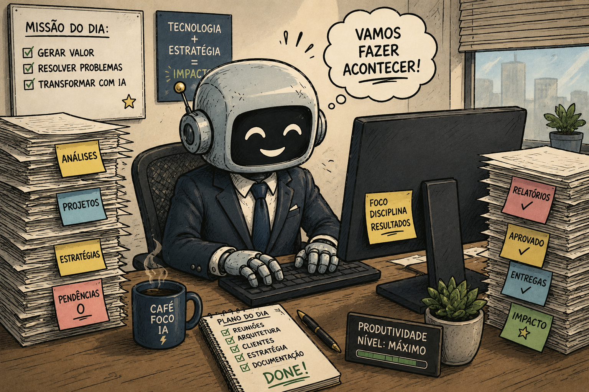

De acordo com grandes estudos do [Gartner](https://www.gartner.com/en/newsroom/press-releases/2026-04-07-gartner-says-artificial-intelligence-projects-in-infrastructure-and-operations-stall-ahead-of-meaningful-roi-returns) e do [MIT](https://fortune.com/2025/08/18/mit-report-95-percent-generative-ai-pilots-at-companies-failing-cfo/), grande parte dos projetos que envolvem Inteligência Artificial falha por uma série de motivos, desde falhas de planejamento até falhas na execução. Aqui vou discorrer sobre alguns pontos de vista e sugestões de como mitigar esses problemas.

Escrevo este artigo em 2026. No momento atual, temos uma gama enorme de ferramentas que usam IA para resolver problemas dos mais simples aos mais complexos. A IA, de forma geral, se popularizou através da Inteligência Artificial Generativa. Em 2020, já era popular, para o público especializado, usar Redes Generativas Adversariais para replicar estilos de imagens. As LLMs começaram a evoluir e veio o ChatGPT. A partir desse ponto na história, iniciou-se o grande boom. IA Generativa se tornou praticamente sinônimo de usar IA e, a partir daí, todo pitch de startup adotou IA como parte do vocabulário.

Ao mesmo tempo que a IA Generativa trouxe novas formas de resolver problemas, criou uma enorme onda de demanda para um departamento que nem existia antes na empresa. O primeiro grande problema é onde se encaixa a IA na empresa. Em algumas empresas, ficou a cargo da área de dados; em outras, da TI; em empresas menos estruturadas, ficou a cargo do departamento oculto das empresas, a Shadow IT.

Cria-se aqui um dos primeiros problemas. Com uma grande quantidade de ferramentas disponíveis para resolver uma série de problemas do dia a dia, por que não usá-las para me ajudar no trabalho? A resposta é bem simples: porque perdemos o controle de um dos ativos de maior valor nas empresas, os dados. Usar essas ferramentas sem governança é entregar a terceiros os dados da empresa sem saber, ou ter garantias, de como esses dados serão utilizados.

Neste ponto, uma parte das empresas entendeu que IA Generativa não é apenas um assunto do momento ou uma buzzword, mas sim um advento que veio para modificar a forma pela qual realizamos nossas tarefas, mesmo que exista um grande receio com a bolha de IA. Mas isso é assunto para outra hora. No ponto em que estamos, não tem como voltar atrás. Deixar de usar IA é ceder espaço aos concorrentes. O diferencial será utilizá-la com uma estratégia bem definida e que **não dependa de um único fornecedor**.

A corrida pelo uso de IA nas empresas começou com atenção a dois pontos: a atenção do mercado e dos investidores e o ganho de desempenho por meio da evolução de seus processos. Uma nova tecnologia era despejada sobre o departamento técnico, que nem sempre estava preparado para utilizá-la. Decisões top-down em empresas com pouca maturidade de uso, pressão das diretorias pela adoção quando mal existe um caso de uso. É a fórmula do caos, que quase sempre tem o mesmo resultado: a falha no projeto.

Outras empresas até conseguem usar IA, mas não têm maturidade para seus projetos, e as falhas surgem em processos posteriores. Essas falhas não são exclusivas de projetos de IA, mas, na verdade, expõem falhas internas dos processos da própria empresa.

Um exemplo é a falha na previsibilidade de uso. A equipe não consegue estimar quem vai utilizar a solução, quantos usuários vão utilizá-la e qual será sua utilização média, ou até mesmo estimar os custos para avaliar a relação entre custo e benefício. O uso de IA pode realmente facilitar o trabalho ou os processos, mas pode trazer um custo alto para isso, tornando o projeto em si inviável.

Planejamento e processos bem estruturados não garantem que os projetos não falhem, porque existem fatores externos, além do desenvolvimento, que interferem no resultado. Porém, ajudam a entender melhor o valor do projeto e a evitar decisões precipitadas.

De acordo ainda com o relatório do MIT mencionado anteriormente, um dos principais motivos de falhas em projetos de IA é a adaptação da ferramenta ao público. Pode ser desenvolvida uma solução robusta, mas sua adoção pode não acontecer por parte do seu público, os usuários. Aqui, um dos principais causadores é a falta ou falha de comunicação entre a área de negócio e a área técnica.

Já de acordo com o Gartner, além dos pontos mencionados anteriormente, existem dois pontos que são bem delicados em projetos que envolvem IA: **Expectativas Irreais** e **Baixa Qualidade de Dados**. As expectativas irreais talvez sejam uma consequência direta do momento que vivemos. Diariamente vemos novos modelos, ferramentas e agentes sendo apresentados como capazes de resolver problemas cada vez mais complexos. Uma demonstração controlada funciona perfeitamente, um vídeo de poucos minutos impressiona e rapidamente surge a pergunta: por que não fazemos isso dentro da empresa?

O problema começa quando confundimos uma demonstração com uma solução pronta para produção. Entre um protótipo funcionando e uma aplicação sendo utilizada diariamente por centenas ou milhares de usuários existe um caminho que envolve segurança, governança, observabilidade, disponibilidade, integração com sistemas existentes, controle de custos e uma série de outros fatores que não aparecem em uma demonstração.

Também existe uma expectativa de que a IA seja capaz de resolver problemas que a própria empresa ainda não conseguiu estruturar. Se um processo é ruim, adicionar IA não necessariamente vai torná-lo melhor. Em alguns casos, podemos apenas automatizar um processo ruim e fazer com que ele execute seus problemas mais rapidamente. Neste caso só esta potencializando o problema ao invés de ajudar na solução.

O segundo ponto é a baixa qualidade dos dados. Podemos utilizar o melhor modelo disponível, criar uma arquitetura robusta e investir em uma grande infraestrutura, mas, se os dados fornecidos para a solução forem ruins, dificilmente teremos bons resultados. Esse problema se torna ainda mais evidente com aplicações que utilizam RAG, agentes ou outras formas de fornecer contexto aos modelos. Não adianta discutir qual é o melhor modelo, tamanho da janela de contexto ou estratégia de busca se os documentos estão desatualizados, duplicados, sem estrutura ou simplesmente não possuem a informação necessária para responder à pergunta.

IA não corrige automaticamente problemas de dados. Muitas vezes ela apenas torna esses problemas mais visíveis. E talvez aqui esteja um dos pontos mais importantes sobre projetos de IA: **nem todo problema precisa de IA**.

Com a popularização da tecnologia, começamos a procurar onde podemos utilizar IA antes mesmo de entender qual problema queremos resolver. A ordem deveria ser justamente a contrária. Primeiro entendemos o problema, depois avaliamos quais tecnologias podem resolvê-lo e, somente então, decidimos se IA faz sentido.

Um projeto simples, que automatiza uma tarefa pequena e repetitiva, mas que possui usuários, métricas e retorno claramente definidos, pode gerar muito mais valor do que uma grande plataforma de IA criada apenas porque a empresa precisava mostrar ao mercado que estava utilizando Inteligência Artificial.

## Então, como evitar que projetos de IA falhem?

Não existe uma fórmula que garanta o sucesso de um projeto, mas podemos reduzir bastante as chances de falha começando pelo básico: entender o problema que queremos resolver.

Antes de escolher o modelo, o provedor ou a arquitetura, precisamos entender quem vai utilizar a solução, qual problema ela resolve, quais dados serão necessários, quanto estamos dispostos a gastar e, principalmente, como vamos medir se ela realmente trouxe algum benefício.

Também precisamos aproximar as áreas técnicas das áreas de negócio. Um projeto de IA não deveria ser exclusivamente um projeto da TI, da área de dados ou de uma diretoria. Quem desenvolve precisa entender o problema e quem possui o problema precisa participar do desenvolvimento e da validação da solução.

Começar pequeno também ajuda. Um projeto piloto não precisa resolver todos os problemas da empresa. Ele precisa responder se aquela hipótese faz sentido. Se funcionar, evoluímos. Se não funcionar, aprendemos com um custo controlado.

E precisamos aceitar que alguns projetos vão falhar.

Falhar em um experimento pequeno porque descobrimos que uma tecnologia não resolve determinado problema não é necessariamente algo ruim. O problema é investir meses de desenvolvimento, infraestrutura e recursos em uma solução sem ter definido anteriormente o que significaria sucesso.

No final, talvez projetos de IA não falhem por motivos tão diferentes de outros projetos de tecnologia.

Eles falham por falta de planejamento, problemas de comunicação, baixa qualidade dos dados, expectativas irreais, dificuldade de adoção, ausência de métricas e decisões tomadas antes de entendermos completamente o problema.

A diferença é que a velocidade atual da evolução da IA amplifica tudo isso.

A tecnologia muda rapidamente, novas ferramentas surgem todos os dias e existe uma pressão enorme para não ficar para trás. Mas participar dessa corrida não significa necessariamente correr mais rápido.

Significa saber para onde estamos correndo.